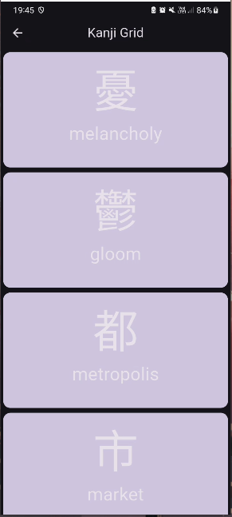
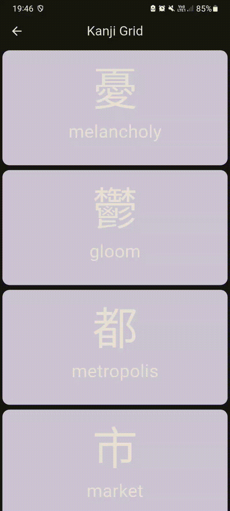

<h1 style="text-align:center"> 言葉 </h1>

言葉(kotoba) Is a simple and hacky kanji extractor that I wrote in the necessity of
an app that could extract kanji from songs or texts, and get the individual meanings
instead of focusing on the phrases.
This is by no means a final or polished product, contributions are accepted,
but keep in mind that this app is just a prototype

<h2 style="text-align:center"> How It Works </h2>
I just iterate over each character in the string
and use a regex expresison to evaluate if given char is in the kanji unicode system, then I use the jisho.org api to get the related kanji data

<h2 style="text-align:center"> Features </h2>

* Import music lyrics or any text
* Support for portuguese and english
* Fully offline
* Uses KanjiDic
* Animated kanji stroke order

<h2 style="text-align:center"> Screenshots </h2>

<h2 style="text-align:center"> Libraries </h2>

* [Unofficial Jisho API(Used in previous version, maybe I'll reintegrate it later)](pub.dev/packages/unofficial_jisho_api)
* [Flutter SVG](https://pub.dev/packages/flutter_svg)
* [Kanji Dictionary](https://pub.dev/packages/kanji_dictionary)
* [Japanese Word Tokenizer(I'm planning to use it later)](https://pub.dev/packages/japanese_word_tokenizer)
* [Url launcher](https://pub.dev/packages/url_launcher)
* [Flutter KanjiVG](https://pub.dev/packages/flutter_kanjivg)
* [KanjiVG](https://kanjivg.tagaini.net/)
* [Change App Package name](https://pub.dev/packages/change_app_package_name)
* [KanjiDic](https://www.edrdg.org/wiki/index.php/KANJIDIC_Project)

